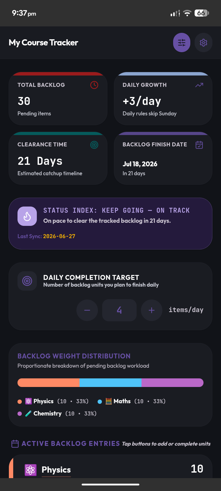
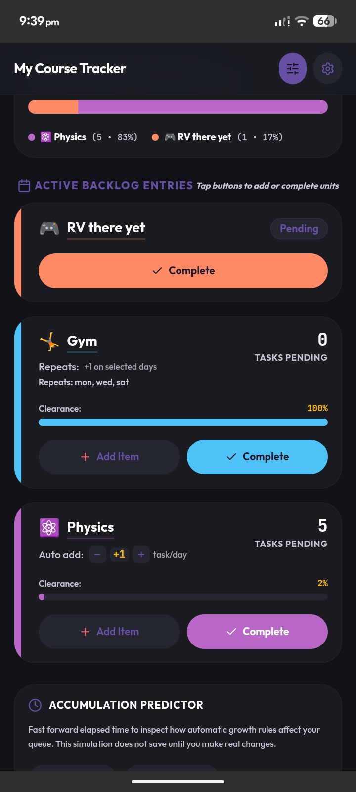
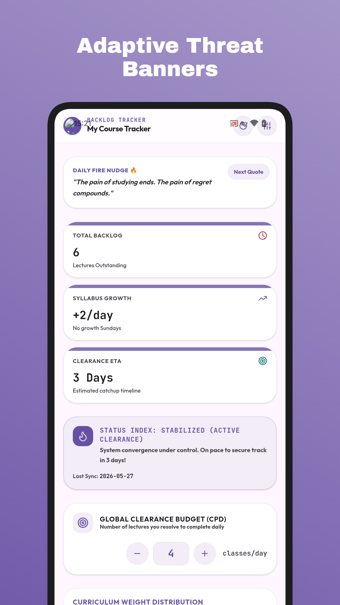
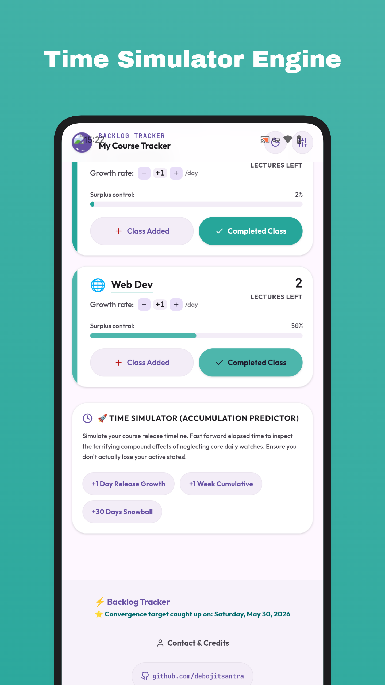

#  Backlog Tracker Android
[](https://f-droid.org/packages/com.debojitsantra.backlogtracker/)


<p align="center">
  
</p>

A beautifully crafted, high-fidelity **Material Design 3** mobile application powered by **React**, **Vite**, **Tailwind CSS v4**, and **Capacitor** to help students calculate, track, and systematically defeat compounding academic backlogs.

---

<!-- Uncomment after IzzyOnDroid listing is approved -->
<!-- <a href="https://apt.izzysoft.de/fdroid/index/apk/com.debojitsantra.backlogtracker"></a> -->


---

##  Features

- **Smart Course Setup Wizard**: Painless onboarding configuration supporting standard preset curriculums and custom modular subjects.
- **Adaptive Threat Banner**: An algorithm-powered indicator tracking course convergence timeline (secured, stabilized, overloaded, or critical snowballing state).
- **Time Simulator / Predictor**: A predictive tool to fast-forward elapsed days and visualize the exact cumulative compound effects of neglecting daily targets.
- **Material You Dynamic Coloring**: Premium MD3 palette adapting meticulously across light themes and high-contrast ambient dark modes.
- **Robust Client Persistence**: Secure offline-first database mapping utilizing local browser and native state managers.

---

## Screenshots

<p align="center">
  
  
  
  
  
</p>

---

## Tech Stack

- **Frontend**: React 18, TypeScript, Tailwind CSS v4, Motion (Animations)
- **Native Shell**: `@capacitor/core`, `@capacitor/android` (for compiling high-performance Android APKs)
- **Build System**: Vite, ESLint
- **CI/CD Pipeline**: GitHub Actions for automated, cloud-based APK generation

---

## Install

Grab the latest release from 


<p>
  <a href="https://github.com/debojitsantra/BacklogTracker-Android/releases">
    
  </a>
  &nbsp;&nbsp;
  <a href="https://f-droid.org/packages/com.debojitsantra.backlogtracker">
    
  </a>
</p>

---

##  Local Development & Web Execution

### Prerequisites
- **Node.js** `v22.0.0` or higher
- **NPM** (bundled with Node)

### Run the Web Server
```bash
npm install
npm run dev
```

---

##  Native Android Build

### Prerequisites
- **Android Studio** with Android SDK and build tools installed
- **Gradle** environment configured

### Build Steps
```bash
# 1. Build the web bundle
npm run build

# 2. Sync into Capacitor's Android project
npx cap sync android

# 3. Open in Android Studio
npx cap open android
```

Press **Run** inside Android Studio to launch on your device or emulator.

---

##  Automated CI/CD (GitHub Actions)

Pushing a version tag (e.g. `v1.0`) triggers a fully automated signed release build.

The workflow (`.github/workflows/build.yml`) uses **Node.js 22** and **JDK 21** to build, sign, and publish the APK to GitHub Releases automatically.

---

##  Author

- Maintainer: **Debojit Santra**
- Documentation & some ui features made using Gemini
- GitHub Portfolio: [github.com/debojitsantra](https://github.com/debojitsantra)
