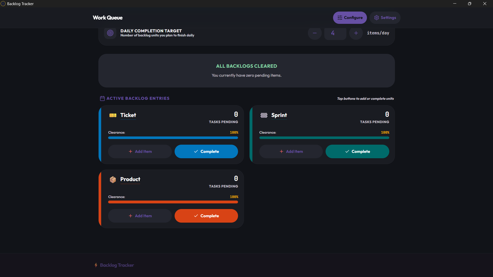
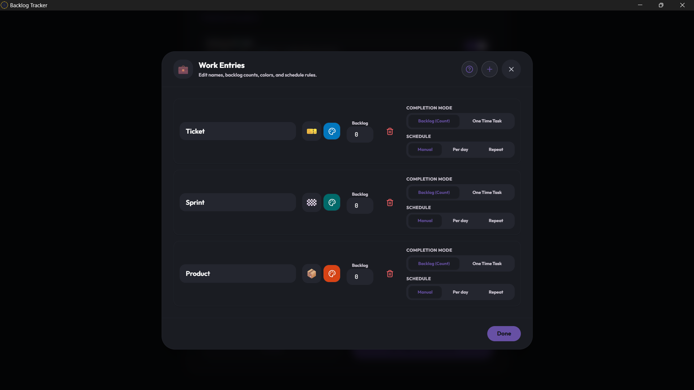
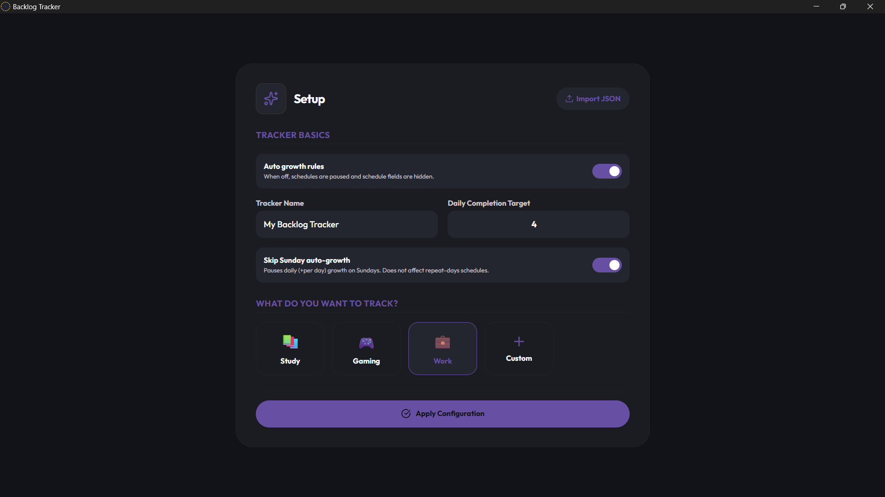
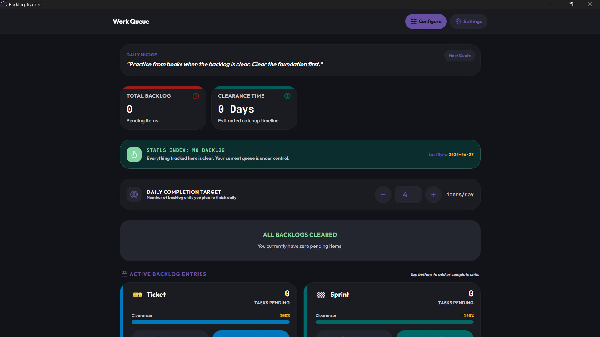

# Backlog Tracker

[](https://f-droid.org/packages/com.debojitsantra.backlogtracker/)


<p align="center">
  
</p>

Backlog Tracker is an offline-first app for Android and desktop. It tracks anything that piles up: study backlogs, work queues, games, habits, routines, or custom pending lists.

## Template Repo

Download tracker templates from:

[backlogdesigner.pages.dev](https://backlogdesigner.pages.dev) 

Source Repository: [Github](https://github.com/debojitsantra/BacklogTracker-Templates)


## Features

- Choose between count-based backlog mode and one-time task mode
- Add per-day or repeat-day automatic growth schedules
- Pause auto-growth when needed
- Estimate clearance time and finish date from your daily completion target
- Preview future backlog growth with the accumulation predictor
- Import and export JSON backups and shareable templates


## Screenshots
### Phone
<p align="center">
  
  
  
  
</p>

### Desktop

<p align="center">
  
  
  
  
</p>

## Tech Stack

- React 
- TypeScript
- Vite
- Tailwind CSS v4
- Motion
- Capacitor for android
- Pake for desktop packaging

## Install

Download latest github release for your platform:

| Platform | Download |
|----------|----------|
| Windows  | [BacklogTracker-windows.zip](https://github.com/debojitsantra/BacklogTracker/releases/) |
| Linux    | [BacklogTracker-linux.zip](https://github.com/debojitsantra/BacklogTracker/releases/) |
| macOS    | [BacklogTracker-macos.zip](https://github.com/debojitsantra/BacklogTracker/releases/) *(untested)* |
| Android  | [BacklogTracker.apk](https://github.com/debojitsantra/BacklogTracker/releases/) |


## App Stores

### Android

<a href="https://f-droid.org/packages/com.debojitsantra.backlogtracker">
    
</a>

### Windows

<a href="https://apps.microsoft.com/detail/9p112ngslvf0?referrer=appbadge&mode=full" target="_blank"  rel="noopener noreferrer">
	
</a>


## Local Development

### Prerequisites

- Node.js 22 or newer

### Run Web Dev Server

```bash
npm install
npm run dev
```

### Build Web Bundle

```bash
npm run build
```

## Android Build

### Prerequisites

- Android Studio
- Android SDK/build tools
- Java 21
- Node.js 22 or newer

### Build Steps

```bash
npm ci
npm run build
npx cap sync android
npx cap open android
```

Run from Android Studio, or use Gradle from the `android` directory.

## Desktop Builds


```text
.github/workflows/desktop.yml
```

It builds Linux, Windows, and macOS desktop packages from the local Vite output using `--use-local-file`.


## GitHub Actions

- `.github/workflows/build.yml` builds the signed Android release APK on version tags.
- `.github/workflows/desktop.yml` builds Linux, Windows, and macOS desktop artifacts with Pake.


## Important Declaration

Documentation and some UI features were made using Gemini. Everything is reviewed manually before committing.
